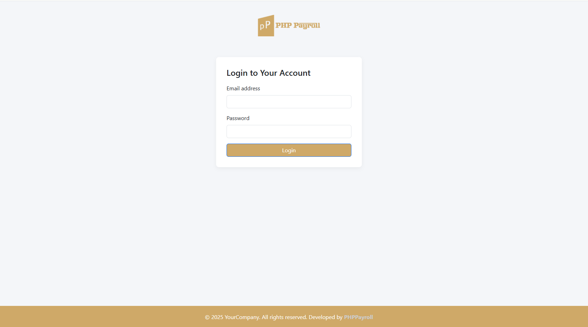

<p align="center">
  <a href="https://www.phppayroll.com" target="_blank">
    
  </a>
</p>

<h1 align="center">PHPPayroll – Open Source Payroll Management Software</h1>

<p align="center">
  <strong>
    Modern, secure, and flexible payroll & HR management system built with PHP & MySQL
  </strong>
</p>

<p align="center">
  
  
  
  
  <a href="SECURITY.md">
    
  </a>
  
  <a href="https://www.phppayroll.com">
    
  </a>
</p>


# PHPPayroll – Open Source Payroll Management Software

PHPPayroll is a modern, lightweight, and flexible **Payroll Management System** built using **PHP** and **MySQL**.
It helps organizations manage **employees, attendance, leave, and payroll processing** efficiently.

Designed for **small to mid-sized organizations**, PHPPayroll is easy to deploy, customize, and extend.

---

## 🚀 Features (v3.0.0)

### 📊 Dashboard
- Total Employees
- Active Employees
- Today’s Attendance
- Pending Leave Requests

### 👥 Employee Management
- Add employees
- View employee list

### 🕒 Attendance Management
- Mark daily attendance
- View attendance records

### 📝 Leave Management
- Submit leave requests
- Track pending leaves

### 💰 Payroll
- Generate payroll

### 🔐 User Account & Security
- Secure login system
- Change password
- Logout functionality

---

## 🛠 Technology Stack
- PHP 7.4+ (PHP 8+ recommended)
- MySQL / MariaDB
- Apache or Nginx
- Bootstrap-based Responsive UI

---

## 📦 Installation (Quick Start)

1. Download or clone the repository.
2. Create a MySQL / MariaDB database (UTF8MB4 recommended).
3. Import:
   ```
   /database/phppayroll_install.sql
   ```
4. Configure:
   ```
   /app/config/database.php
   ```
5. Open:
   ```
   http://localhost/phppayroll/public/
   ```
6. Change the default admin password immediately.

📘 Full Guide: **INSTALLATION.md**

---

## 🌐 Deployment

Production deployment instructions:
👉 **DEPLOYMENT.md**

---

## 🔐 Security
Security best practices and vulnerability reporting:
👉 **SECURITY.md**

---

## 🧾 Changelog
All version updates:
👉 **CHANGELOG.md**

---

## 🤝 Contributing
We welcome contributions:
👉 **CONTRIBUTING.md**

---

## 📸 Screenshots

### Dashboard



---

## 🌍 Open Source & License

PHPPayroll is released under the **MIT License**.
You are free to use, modify, rebrand, and deploy it commercially.

---

### ⭐ Project Status
- Stable Release: **v3.0.0**
- Actively maintained
- Production-ready

---

**Thank you for choosing PHPPayroll Open Source!**
